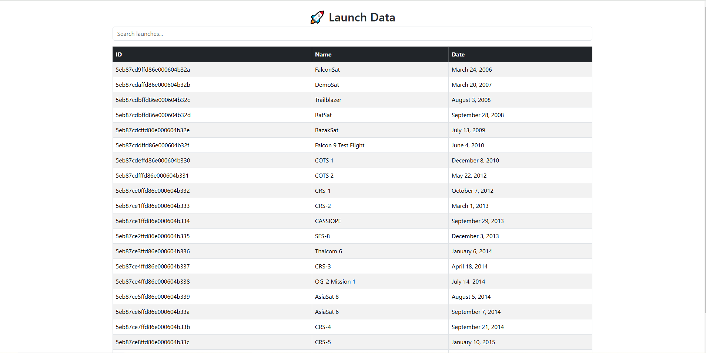
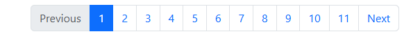

🚀 MyProject Frontend

This project is a Vue 3 frontend built with TypeScript, consuming an API to display launch data from a database in a paginated grid.

📸 Preview

 

🔧 Installation & Setup

1️⃣ Install Dependencies

Make sure you have Node.js installed, then run:

npm install

2️⃣ Run the Development Server

npm run serve

This will start the project at:

http://localhost:8080/

📡 API Integration

This frontend consumes a .NET Web API running at:

http://localhost:5168/api

Make sure your backend is running before testing the frontend.

To start the API:

dotnet run --project MyProject.Api

To start the Worker Service (for background jobs):

dotnet run --project MyProject.Worker

📊 Features

✅ Launch data displayed in a grid✅ Filter launches by name✅ Pagination (20 items per page)✅ Bootstrap for styling✅ Axios for API calls

📜 How It Works

The Launch Grid component fetches data from the API and displays it with a filter and pagination.

Calls GET /api/launch to fetch data.

Uses Bootstrap table for styling.

Implements pagination to show 10 items per page.

Includes a search input to filter results.

📷 Screenshot Example

Replace with actual screenshot:

📦 Dependencies

Vue 3 (with Composition API)

Axios (for API requests)

Bootstrap (for UI styling)

